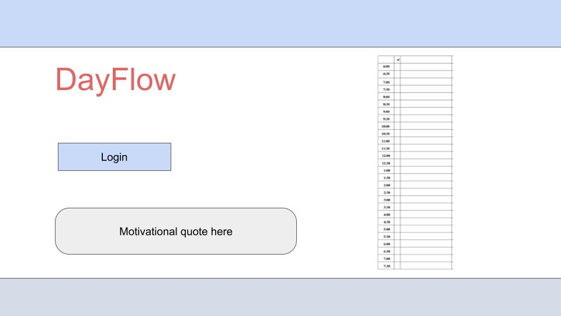
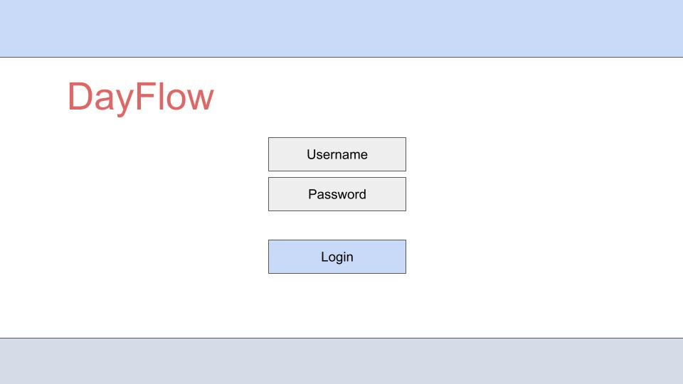
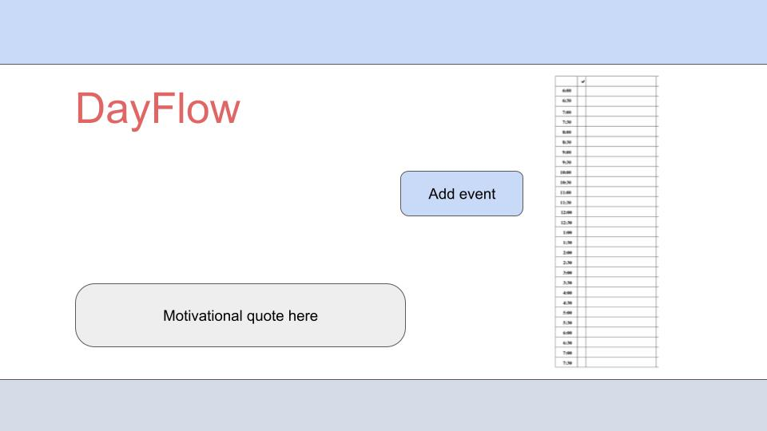
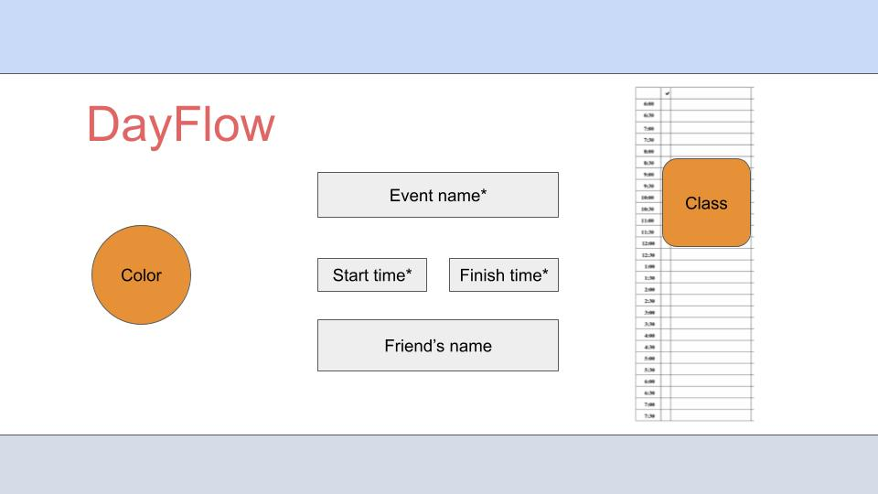

# DayFlow

[My Notes](notes.md)

This web app will allow anyone to login and plan out their day, as well as invite their friends to participate in events!


[//]: # (> [!NOTE])

[//]: # (>  This is a template for your startup application. You must modify this `README.md` file for each phase of your development. You only need to fill in the section for each deliverable when that deliverable is submitted in Canvas. Without completing the section for a deliverable, the TA will not know what to look for when grading your submission. Feel free to add additional information to each deliverable description, but make sure you at least have the list of rubric items and a description of what you did for each item.)

[//]: # (> [!NOTE])

[//]: # (>  If you are not familiar with Markdown then you should review the [documentation]&#40;https://docs.github.com/en/get-started/writing-on-github/getting-started-with-writing-and-formatting-on-github/basic-writing-and-formatting-syntax&#41; before continuing.)

## 🚀 Specification Deliverable

[//]: # (> [!NOTE])

[//]: # (>  Fill in this sections as the submission artifact for this deliverable. You can refer to this [example]&#40;https://github.com/webprogramming260/startup-example/blob/main/README.md&#41; for inspiration.)

For this deliverable I did the following. I checked the box `[x]` and added a description for things I completed.

- [x] Proper use of Markdown
- [x] A concise and compelling elevator pitch
- [x] Description of key features
- [x] Description of how you will use each technology
- [x] One or more rough sketches of your application. Images must be embedded in this file using Markdown image references.

### Elevator pitch

Are you tired of feeling overwhelmed by your daily tasks and struggling to stay organized? Introducing DayFlow, the simple yet powerful daily planner web app that helps you take control of your day.  

DayFlow is designed for busy professionals and students who want to boost their productivity without the complexity of traditional planning tools. With our intuitive interface, you can quickly add events to flow through your day, all while including your friends!  

In fact, early users report a 30% increase in daily task completion and significantly reduced stress levels. Ready to transform your daily routine? Try DayFlow today and experience the difference a well-organized day can make.

### Design Mockups

This is the landing page.  
<br>
This is the login page.  
<br>
This is the general calendar page where you can view your day.  
<br>
This is the page where you can create an event.  



[//]: # ()
[//]: # (```mermaid)

[//]: # (sequenceDiagram)

[//]: # (    actor You)

[//]: # (    actor Website)

[//]: # (    You->>Website: Replace this with your design)

[//]: # (```)

### Key features

- A daily schedule where you can create events
- The ability to share events and schedules with friends
- Motivational quotes to help you keep the desire to be effective

### Technologies

I am going to use the required technologies in the following ways.

- **HTML** - Structure the website pages. There will be a home page, a login, and a calendar page where events can be created and seen. 
- **CSS** - Beautify the website to enhance the user experience. It will help the website scale to difference screen sizes and be effective.
- **React** - Provide interactability for the users and design the event planner. This will also enable the login service. Backend endpoint calls will be done through React as well. 
- **Service** - Motivational quotes to encourage users to keep planning, as well as creating events and inviting users. 
- **DB/Login** - People's events and login information are stored in the database.
- **WebSocket** - Users who are working together on events can talk about them. 

## 🚀 AWS deliverable

For this deliverable I did the following. I checked the box `[x]` and added a description for things I completed.

- [x] **Server deployed and accessible with custom domain name** - [DayFlow](http://dayflow.click).

## 🚀 HTML deliverable

For this deliverable I did the following. I checked the box `[x]` and added a description for things I completed.

- [x] **HTML pages** - I designed the skeleton of each page myself, using body, nav, main, header, footer, div, and table tags. 
- [x] **Proper HTML element usage** - I used the tags as they are designed to be used. 
- [x] **Links** - The buttons link to the expected pages. Home->Login->Main->Event Creation->Main
- [x] **Text** - Necessary explanations are present. 
- [x] **3rd party API placeholder** - Quotes will come from a 3rd party API.
- [x] **Images** - I designed a logo with the help of AI and several other websites. I will be re-designing it in the future with Adobe Illustrator.
- [x] **Login placeholder** - The login page is present. 
- [x] **DB data placeholder** - Login, calendar, and task data will all be stored in the database. 
- [x] **WebSocket placeholder** - Where users can discuss events together is present. 

## 🚀 CSS deliverable

For this deliverable I did the following. I checked the box `[x]` and added a description for things I completed.

- [x] **Header, footer, and main content body** - I styled the navigation to use special fonts (and backup fonts). I also made the logo and name hyperlinks to the main page. I also styled the calendar table to look better.
- [x] **Navigation elements** - The navigation elements now have hover functionality and don't change color if it has been clicked.
- [x] **Responsive to window resizing** - Website looks great on all window sizes. 
- [x] **Application elements** - All application elements have been created and styled.
- [x] **Application text content** - Application has applicable text content, styled to look normal.
- [x] **Application images** - I have an image. 

## 🚀 React part 1: Routing deliverable

For this deliverable I did the following. I checked the box `[x]` and added a description for things I completed.

- [x] **Bundled using Vite** - I did not complete this part of the deliverable.
- [x] **Components** - I did not complete this part of the deliverable.
- [x] **Router** - Routing between login and voting components.

## 🚀 React part 2: Reactivity

For this deliverable I did the following. I checked the box `[x]` and added a description for things I completed.

- [ ] **All functionality implemented or mocked out** - I did not complete this part of the deliverable.
- [ ] **Hooks** - I did not complete this part of the deliverable.

## 🚀 Service deliverable

For this deliverable I did the following. I checked the box `[x]` and added a description for things I completed.

- [ ] **Node.js/Express HTTP service** - I did not complete this part of the deliverable.
- [ ] **Static middleware for frontend** - I did not complete this part of the deliverable.
- [ ] **Calls to third party endpoints** - I did not complete this part of the deliverable.
- [ ] **Backend service endpoints** - I did not complete this part of the deliverable.
- [ ] **Frontend calls service endpoints** - I did not complete this part of the deliverable.

## 🚀 DB/Login deliverable

For this deliverable I did the following. I checked the box `[x]` and added a description for things I completed.

- [ ] **User registration** - I did not complete this part of the deliverable.
- [ ] **User login and logout** - I did not complete this part of the deliverable.
- [ ] **Stores data in MongoDB** - I did not complete this part of the deliverable.
- [ ] **Stores credentials in MongoDB** - I did not complete this part of the deliverable.
- [ ] **Restricts functionality based on authentication** - I did not complete this part of the deliverable.

## 🚀 WebSocket deliverable

For this deliverable I did the following. I checked the box `[x]` and added a description for things I completed.

- [ ] **Backend listens for WebSocket connection** - I did not complete this part of the deliverable.
- [ ] **Frontend makes WebSocket connection** - I did not complete this part of the deliverable.
- [ ] **Data sent over WebSocket connection** - I did not complete this part of the deliverable.
- [ ] **WebSocket data displayed** - I did not complete this part of the deliverable.
- [ ] **Application is fully functional** - I did not complete this part of the deliverable.
